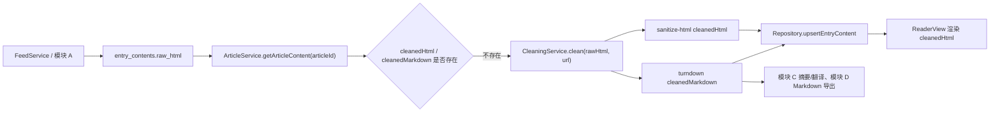

# 模块 B：内容清洗与阅读视图实现说明

## 1. 模块目标

模块 B 负责把模块 A 抓取并存储的 `rawHtml` 转换成可阅读、可导出、可供 AI 摘要/翻译使用的正文内容。

当前交付范围：

- 使用 `@mozilla/readability` 从原始 HTML 中提取正文。
- 使用 `sanitize-html` 清洗 HTML，移除脚本、广告、导航、评论、侧边栏等噪声。
- 使用 `turndown` 生成 `cleanedMarkdown`。
- 在 `ArticleService.getArticleContent()` 中自动触发清洗并持久化结果。
- 在 `ReaderView.vue` 中渲染清洗后的正文，并支持加载、失败、空正文兜底状态。
- 接入阅读设置：字号、行距、浅色/深色主题。
- 在文章详情页展示文章标签，便于和模块 D 的标签管理对接。

## 2. 核心文件

| 文件 | 作用 |
|---|---|
| `src/main/services/CleaningService.ts` | 正文提取、HTML 清洗、Markdown 转换、失败兜底 |
| `src/main/services/ArticleService.ts` | 读取文章内容；缺少 `rawHtml` 时抓取；缺少清洗结果时调用 CleaningService |
| `src/main/services/interfaces.ts` | `ICleaningService.clean(rawHtml, url)` 接口定义 |
| `src/main/types/index.ts` | `ArticleContent`、`CleanedContent` 类型定义 |
| `src/renderer/components/ReaderView.vue` | 阅读视图渲染、按钮、正文样式、加载/错误状态 |
| `src/renderer/App.vue` | 文章选择、加载状态、阅读设置读取和传递 |
| `src/renderer/components/SettingsView.vue` | 保存阅读偏好后通知阅读视图刷新 |
| `test/module-b-cleaning-verification.cjs` | CleaningService 自动化验证 |
| `test/module-b-article-service-verification.cjs` | ArticleService 与 CleaningService 对接验证 |

## 3. 数据流



## 4. 服务接口

### ICleaningService

```ts
interface ICleaningService {
  clean(rawHtml: string, url: string): Promise<CleanedContent>
}

interface CleanedContent {
  cleanedHtml: string
  cleanedMarkdown: string
  title?: string
  author?: string
}
```

约定：

- `rawHtml` 为空时不会抛异常，会返回带原文链接的兜底内容。
- `url` 用于解析正文中的相对链接、图片链接、`srcset`。
- 返回的 `cleanedHtml` 已经过白名单清洗，可直接在 ReaderView 中用 `v-html` 渲染。
- 返回的 `cleanedMarkdown` 是模块 C 和模块 D 的首选正文输入。

### ArticleService 对接点

`getArticleContent(articleId)` 的行为：

1. 读取文章条目和内容。
2. 如果 `rawHtml` 缺失，则按文章 URL 抓取原文 HTML 并保存。
3. 如果 `cleanedHtml` 或 `cleanedMarkdown` 缺失，则调用 `CleaningService.clean(rawHtml, url)`。
4. 保存清洗结果。
5. 返回包含 `rawHtml`、`cleanedHtml`、`cleanedMarkdown`、标签等字段的 `ArticleContent`。

## 5. 清洗规则

当前保留的正文元素包括：

- 标题、段落、列表、引用、代码块、表格、分割线。
- 图片、`picture/source`、`srcset`、图注。
- 链接、时间、上下标、标记文本。
- 技术文章常见的 `kbd`、`samp`、`var`、`ins`、`del`。

当前清理的噪声包括：

- `script`、`style`、`noscript`、`iframe`、表单。
- 导航栏、侧边栏、页脚、评论区、分享区、广告区。
- 1x1 跟踪像素。
- 非安全协议链接，例如 `javascript:`。

图片处理：

- 支持 `data-src`、`data-original`、`data-original-src`、`data-lazy-src` 等懒加载图片属性。
- 支持 `data-srcset` 和 `source[srcset]`。
- 相对链接统一解析为绝对 URL。
- `data:` 图片仅允许安全的图片 MIME 类型，拒绝 SVG data image。

## 6. ReaderView 行为

ReaderView 接收：

```ts
article: ArticleContent | null
isLoading?: boolean
error?: string
readingSettings?: {
  fontSize: string
  lineHeight: string
  theme: string
}
```

显示优先级：

1. `isLoading=true`：显示“文章加载中”。
2. `error` 非空：显示正文加载失败。
3. `article` 存在且 `cleanedHtml` 非空：渲染正文。
4. `article` 存在但正文为空：显示打开原文的兜底提示。
5. 未选择文章：显示空状态。

文章标签：

- `article.tags` 非空时，会在标题元信息下方展示标签。
- 标签展示只读，不负责新增/删除；新增标签仍由顶部“添加标签”按钮触发模块 D 流程。

阅读设置：

- `reading.fontSize`：默认 `16`，有效范围 14-22。
- `reading.lineHeight`：默认 `1.8`，有效范围 1.4-2.2。
- `reading.theme`：`light` 或 `dark`。

## 7. 与其他模块的协作

### 模块 A

模块 A 负责订阅源抓取、文章入库、`rawHtml` 存储。模块 B 不改变模块 A 的接口，只读取已有文章内容并在需要时补清洗结果。

### 模块 C

模块 C 做摘要/翻译时优先使用：

```ts
const content = await articleService.getArticleContent(articleId)
const markdown = content.cleanedMarkdown
```

不要直接使用 `rawHtml` 作为 LLM 输入，因为它包含导航、脚本、广告和大量无关 DOM。

### 模块 D

Markdown 导出优先使用 `cleanedMarkdown`。如果缺失，可调用 `getArticleContent()` 触发模块 B 清洗后再导出。

阅读设置由模块 D 的 SettingsService 保存，模块 B 的 ReaderView 负责消费这些设置。

## 8. 验证命令

推荐使用 Node.js 20.19+ 或 22.12+。本机如果系统 Node 过旧，可使用 Codex 自带 Node 24。

```bash
npm run build
npm run verify:module-b
```

`verify:module-b` 会执行：

- TypeScript 主进程构建。
- CleaningService 清洗验证。
- ArticleService 清洗对接验证。

## 9. 已知环境注意事项

- `better-sqlite3` 是原生依赖，完整 `npm install` 可能需要合适的 Node 版本和 Visual Studio C++ Build Tools。
- 当前自动化验证避免直接运行 SQLite 原生模块，便于没有 C++ 工具链的机器也能验证模块 B 逻辑。
- Vite 7 需要 Node.js 20.19+ 或 22.12+；系统 Node 20.10 会导致 dev server 启动失败。

## 10. 后续可扩展点

- 增加真实站点样例库，例如 xkcd、阮一峰博客、少数派、GitHub Blog。
- 根据真实失败样例补站点级噪声规则，不建议提前堆大量站点特例。
- 为 ReaderView 增加文章内目录、图片点击查看大图等增强功能。
- 为 SummaryService 正式接入 `cleanedMarkdown` 后补跨模块集成测试。
